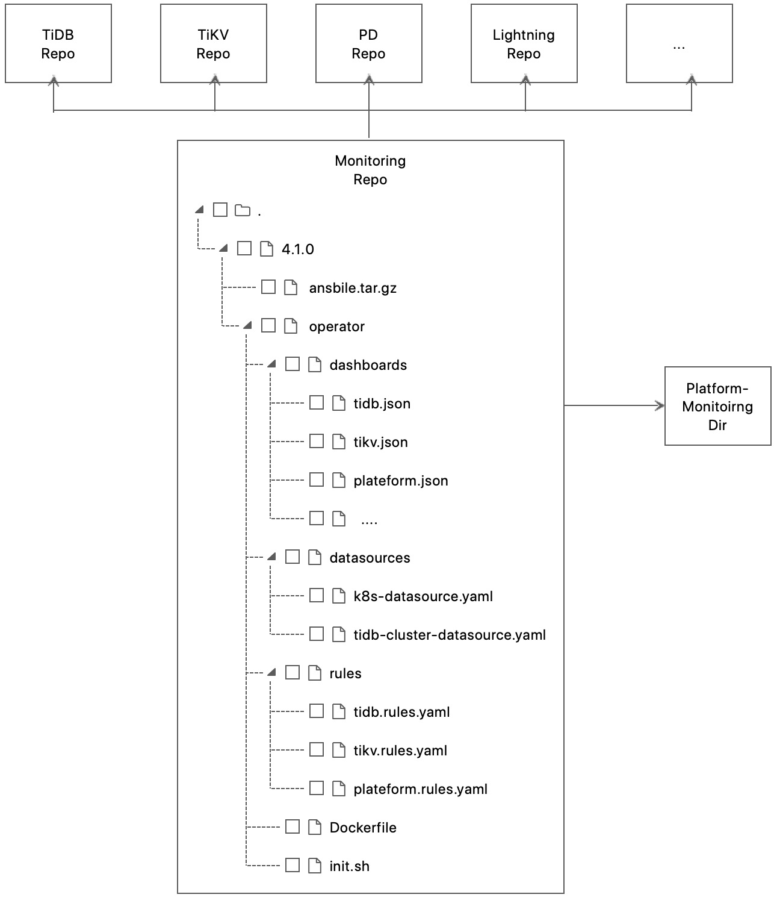
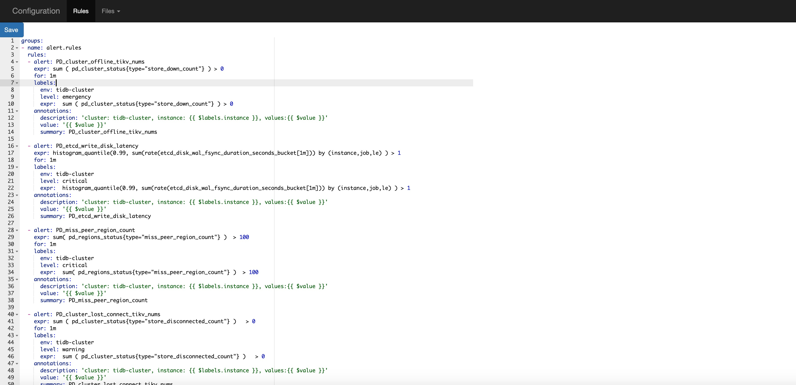

# Overview
This repo contains three functions. One support dynamic reload rules of prometheus, the other is used to support multi TiDB version.

## Function1 - Automatic generation monitoring configurations for ansible deployment and operator deployment

Generate versioned monitoring data that is used by tidb-operator or tidb-ansible. It is a binary to load monitoring configurations from special component repo and it also contain platform monitoring from `platform-monitoring` directory.



Ansible deployment and operator deployment has different platform monitoring files. The structure of platform monitoring directory is here:

```$xslt
platform-monitoring/
     |-- ansbile
     |       |---- grafana
     |       |        | ---- machine.json
     |       |
     |       |---- rule
     |                | ---- machine.rules.yaml
     |
     |-- operator
             |---- grafana
             |        |
             |        |----- node.json
             |---- rule
             |        |
             |        |---- node.rules.yaml
             |---- datasource
                      |
                      |---- k8s-cluster.yaml
                      |
                      |---- tidb-cluster.yaml
           
```

The binary will automate load platform monitoring based on the above directory structure to different deployment directory.

## How to use it

```$xslt
go build -o pull-monitoring  cmd/monitoring.go

./pull-monitoring
Error: required flag(s) "config" not set
Usage:
  load [flags]

Flags:
      --auto-push                        auto generate new branch from master and push auto-generate files to the branch
      --config string                    the monitoring configuration file.
  -h, --help                             help for load
      --output-dir string                the base directory of the program (default ".")
      --tag string                       the tag of pull monitoring repo.

```

## Function2 - Prometheus Rule Reloader

It is a simple binary to trigger a reload when Rules are updated. It watches dirs and call `reload` API that the rules has been changed. 

It provide a UI to update rules(For ease of use, the UI is similar with UI of Prometheus).


The text editor is friendly to Yaml format. To quickly verify that the modification is successful, there is Rules UI which get rules from Prometheus (You can also verify it by Prometheus.).

## How to use it

```$xslt
make
```

There is binary in `reload/build/{plateform}/reload`, you can run it like this

```$xslt
./reload --watch-path=/tmp/prometheus-2.8.0.darwin-amd64/rules --prometheus-url=http://127.0.0.1:9090
```

## Function3 - Cloud TiDB Monitoring

## Overview

Generate versioned monitoring data that is used by tidb-operator. This project pulls TiDB monitoring data from [tidb-ansible](https://github.com/pingcap/tidb-ansible) and uses the git tag to understand the TiDB version.

All TiDB version monitoring information is automatically generated (by default it generates for TiDB version >= 2.1.8). The structure of monitor directory is like this

```$xslt
 monitor/
    |── v2.1.8
    |   ├── dashboards
    |   │   ├─ overview.json 
    |   │   ├─ binlog.json  
    |   │   |_ pd.json
    |   |   |_ tikv_pull.json
    |   |   |_ tidb.json 
    |   |   
    |   |── rules
    |   |   ├── tidb.rule.yml
    |   |   ├── tikv.rule.yml
    |   |   └── pd.rule.yml
    |   |—— Dockerfile     
    |   |__ init.sh
    |
    |── v3.0.0
    |   ├── dashboards
    |   │   |- overview.json 
    |   │   |- binlog.json  
    |   │   |- pd.json
    |   |   |- tidb.json 
    |   |   |- tikv_details.json
    |   |   |- tikv_sumary.json
    |   |   |_ tikv_trouble_shooting.json
    |   |   
    |   |── rules
    |   |   ├── tidb.rule.yml
    |   |   ├── tikv.rule.yml
    |   |   └── pd.rule.yml
    |   |—— Dockerfile     
    |   |__ init.sh
    |___ ...
        
```


## How to use it

```$xslt
make
```

There will be monitoring binary, you can run it like this

```$xslt
./monitoring --path=.
```

The program will replace some variables and the docker will receive 4 variables: 

```$xslt
GF_PROVISIONING_PATH // grafana provisioning path
TIDB_CLUSTER_NAME // TiDB cluster name
TIDB_ENABLE_BINLOG // whether enable binlog
PROM_CONFIG_PATH // proemtheus rules config path
```

## How to Add New Dashbords

Reference PR: https://github.com/pingcap/monitoring/pull/227

1. Add dashbord files into the `dashbords` map in the file `pkg/operator/dashboards.go`, so that the `platform-monitoring` won't filter these files.
   
    ```go
    // pkg/operator/dashboards.go
    dashboards = map[string]string{
		  "binlog.json":                  "Test-Cluster-Binlog",
		  "tidb.json":                    "Test-Cluster-TiDB",
		  "overview.json":                "Test-Cluster-Overview",
      // ...
    }
   ```

   The key is the file name fetched from each github repository, and the value is the dashbord title in Grafana.

2. Update the `init.sh` of the image `monitoring-initializer` to provide new dashbord files for the Grafana.
   
    For example:

    ```bash
    # TiDB dashboard
    # copy dashboard files to the `$GF_PROVISIONING_PATH/dashboards` dir where Grafana loads dashboards.
    cp /tmp/tidb*.json $GF_PROVISIONING_PATH/dashboards  

    # replace some fields
    sed -i 's/Test-Cluster-TiDB/Cluster-TiDB/g' $GF_PROVISIONING_PATH/dashboards/tidb.json
    sed -i 's/Test-Cluster-TiDB/Cluster-TiDB/g' $GF_PROVISIONING_PATH/dashboards/tidb_runtime.json
    sed -i 's/Test-Cluster-TiDB/Cluster-TiDB/g' $GF_PROVISIONING_PATH/dashboards/tidb_resource_control.json
    ```

3. Build the image `monitoring-initializer` and test it locally.

   1. Build the binary `pull-monitoring`.

      ```bash
      make pull-monitoring
      ```
  
   2. Fetch dashbords files and generate the dir used to build a new image.

      ```bash
      ./pull-monitoring --config=monitoring.yaml --tag=${tag_in_target_repo} --token=${your_github_token}
      ```

      You can see a new dir named `${tag}` created in the dir `monitor-snapshot`.

      ```bash
      $ ls ./monitor-snapshot/${tag}/operator
      dashboards  datasources  Dockerfile  init.sh  rules
      ```

    3. Build the image `monitoring-initializer`
   
      ```bash
      cd ./monitor-snapshot/master/operator &&  docker build -t ${image} .
      ```

    4. Follow the [doc](https://docs.pingcap.com/tidb-in-kubernetes/stable/monitor-a-tidb-cluster) and use your image to deploy monitoring.

        Note that you need replace the image `pingcap/tidb-monitor-initializer` and version with your image in the `TidbMonitor` spec.
<!-- VERSION_PLACEHOLDER: v7.5.6 -->